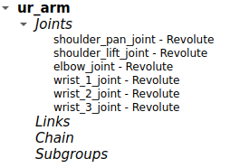
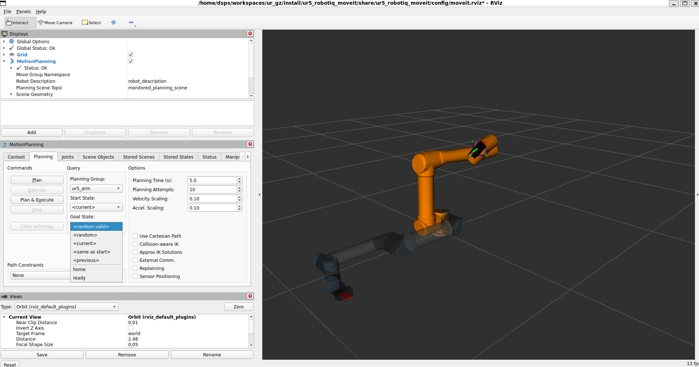

# Configuración Moveit Setup Assistant (MSA)

## Preparación.

1. Confirme que se tiene instalado el paquete Moveit Setup assistant o en su defecto instalelo.
El comando
```
ros2 pkg list | grep assistant
```
Debería retornar `moveit_setup_assistant` en caso que el paquete este instalado.
Si no es asi se puede instalar mediante el siguiente comando, cabiando las llaves con el valor correspondiente a la distro de ROS usada.
```
sudo apt install ros-<distro>-jazzy-moveit-setup-assistant
```

2. Asegurese de haber compilado exitosamente el paquete ur5_robotiq_description y de haber hecho source del workspace asociado.
Ejemplo:
```
source ~/<workspace>/install/setup.bash
```

## Configuración UR5 con gripper simple MSA

Lance la interfaz gráfica del assistant mediante.
```
ros2 launch moveit_setup_assistant setup_assistant.launch.py
```
### 1. Start Screen.
En la primera pestaña seleccione la opción `create New Moveit Configuration Package` y busque la ruta donde se encuentra el archivo ur_with_gripper_moveit.urdf.xacro del paquete ur5_robotiq_description que se compilo.
Luego oprima el boton Load Files, en la ventana debería observar una animación del robot selccionado.
### 2. Self Collisions
Se debe oprimir el botón `Generate Collision matriz` con los valores por defecto de la interfaz. Como resultado debería observar una tabla o una matriz que indica las relaciones de colisiones entre los joints que conforman el robot.

### 3. Virtual Joints
Se debe añadir un joint virtual que asocia los frames de la base del robot con el frame padre al que va a estar atado, para este caso corresponde al frame world.
Parametros de ocnfiguración:
- Virtual Joint Name: world_joint
- Child link: sleccione `base_link_parent`
- Parent Frame Name:  World
- Joiint Type: fixed
En caso que el robot llegase a ser desplegado en una mesa o en un robot movil que tiene un joint de referencia al cual se ata, se deberían cambiar los valores de manera acorde.
### 4. Planing groups.

Se deben definir dos planning groups, que hacen referencia a los conjuntos de joints que conforman secciones relevantes del robot completo y que pueden ser susceptibles a tareas de planificación o pueden realizar algun tipo de movimiento.

1. Grupo 1 Brazo róbotico:
Kinematics parameters
- Group Name: ur_arm
- Kinematic Solver: kdl_kinematics_plugin
- El resto dejarlos con valores por defecto.
Para este grupo se deben añadir los joints asociados, oprimiendo el boton `Add Joints`, en este caso seleccionar de la lista en la parte izquierda y pasar al cuadro de la derecha los siguientes joints:
    - shoulder_pan_joint
    - shoulder_lift_joint
    - elbow_joint
    - wrist_1_joint
    - wrist_2_joint
    - wrist_3_joint
    
Una vez seleccionados se debe guardar en el botón save.


2. Grupo 2 Gripper:
Kinematics parameters
- Group Name: gripper
- Kinematic Solver: None
- El resto dejarlos con valores por defecto.

Para este grupo se deben añadir los joints asociados igual que en el grupo anterior, pero selccionando los isguientes:

    - gripper_finger_joint
    - right_finger_joint
    
Una vez seleccionados se debe guardar en el botón save.

### 5. End Effectors. 

En esta pestaña se configura o indica desde los planning groups existentes, cuales son los efectores finales en el robot y a que grupo padre estan relacionados, generalmente los padres suelen ser brazos roboticos.

- End Effector Name: arm_eef
- End Effector Group: gripper
- Parent Link: tool0

En este caso tool0 es el link que dispone el fabricante en los archivos URDF/XACRO para colocar el efector final.

### 6. Poses.

Esta interfaz permite a traves de controles mover el robot o gripper a poses que puedan ser de interes. 

Para definir una pose del brazo se debe seleccionar el grupo ur_arm, mientras que pare la pinza se debe seleccionar el grupo gripper.

En este caso defina, por lo menos las siguientes poses.

- Brazo: Home, Ready (libre elección)
- Gripper: Open (0.04,0.04), Close (0.004, 0.004)
Se debe tener en cuenta que el robot no este en colisión con el mimso o eventualmente con el plano de trabajo.

## 7. ROS 2 Controllers

En esta sección se configuran los nombres de los controladores que utiliza el robot para controlar el movimiento. Para el caso de los paquetes ur5_robotiq_description/bringup, los controladores son los siguientes, Para añadirlos se debe oprimir el boton `Add`:

    1. Controlador Brazo:
        - Controller Name: scaled_joint_trajectory_controller
        - Controller Type: joint_trajectory_controller

        En la sección inferior seleccionar la opción recomendada (`add planning Group Joints`) y selecccionar el grupo del brazo.

    2. Controlador gripper:
        - Controller Name: gripper_controller
        - Controller Type: position:controllers/GripperActionController

        En la sección inferior seleccionar la opción recomendada (`add planning Group Joints`) y selecccionar el grupo del gripper.

## 8. Moveit Controllers

En esta sección se configuran los nombres de los controladores que utiliza el robot para realizar las operaciones de ejecución de trayectorias, en caso que una acción de planificación sea correcta. Para el caso de los paquetes ur5_robotiq_description/bringup, debe coincidir con los controladores de ROS2 controlcon los isuientes parametros:

    1. Controlador Brazo:
        - Controller Name: scaled_joint_trajectory_controller
        - Controller Type: FollowTrajectory
        - Default: True

        En la sección inferior seleccionar la opción recomendada (`add planning Group Joints`) y selecccionar el grupo del brazo.

    2. Controlador gripper:
        - Controller Name: gripper_controller
        - Controller Type: GripperCommand
        - Default: False

        En la sección inferior seleccionar la opción recomendada (`add planning Group Joints`) y selecccionar el grupo del gripper.

### 9. Secciones restantes. 

Las demas secciones se pueden configurar con los valores por defecto (launch, Passive joints, ros2_Control URDF), mientras que algunas de ellas no son necesarias para el estado actual del robot a configurar (como el caso de percepción). 

### 10. Configuration Files.

En la pestaña final se debe seleccinar la ruta donde se va a generar el paquete de ROS con la configuración de moveit, donde el asistente se encarga de generar los archivos correspondientes. De los archivos generados uno de los más importantes es el arhivo srdf, que ontiene la información de configuración de moveit, tambien se generan archivos launch para visualizar el robot rn rviz (como el archivo launch demo).

### 11. Uso del paquete Moveit.

Una vez se tengan los archivos del paquete este se debe compilar y hacer source nuevamente par que sea identificado por el sistema.

Ejecutar demo, ejemplo de comando:
```
ros2 launch ur5_robotiq_moveit demo.launch.py
```
El comando anterior ejecuta un demo donde se lanza una ventana de rviz en la que se debe visualizar el robot y a la izquierda el plugin de moveit con el cual se puede interactuar para planificar la trayectoria a un punto deseado.

